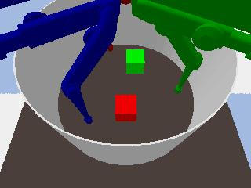
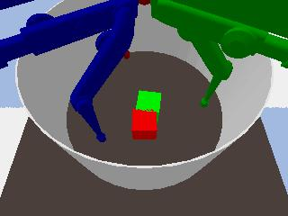
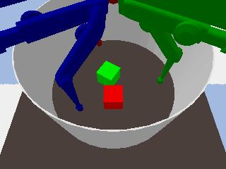
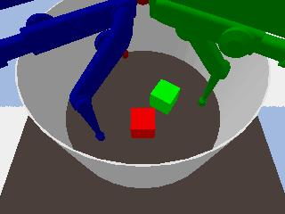
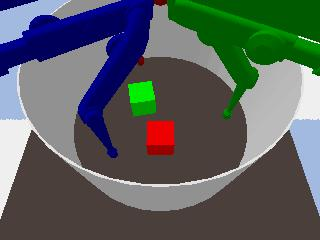
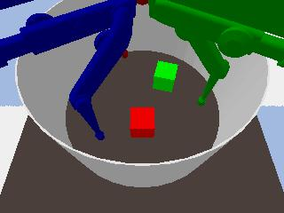
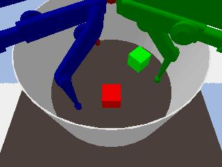

# Submission6148
This repo contains supplementary materials for paper 6148

## Generated subgoal curriculum
0. Goal state

1. Subogal at 1000k

2. Subogal at 2000k

3. Subogal at 3000k

4. Subogal at 4000k

5. Subogal at 5000k

6. Subogal at 6000k

7. Subogal at 7000k

8. Subogal at 8000k

9. Subogal at 9000k

10. Subogal at 10000k

